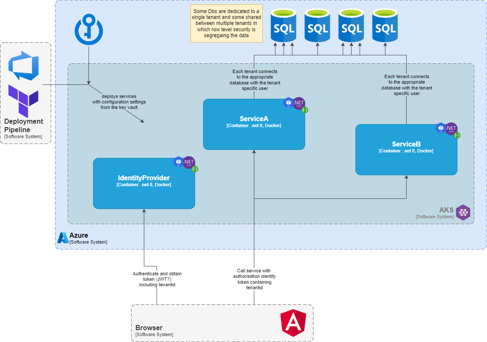

# Introduction 

Example showing a Multi-Tenancy data segregation approach with Azure Sql Servers row level security and dotnetcore services with entity framework core.
The basic pricipal is that it switches the db connection string used by the DbContext based on the tenantid for each request. 
The connection strings are loaded from configuration, which in this example just loads from a file, however the actual services would be delivered to the configuration from Azure Key vaults at deployment time. 
The tenantid is obtained by dotnetcore middleware. In this example it passes the tenantid on the query string, however in the actual services it would be obtained from the identity provider used in the frontend application. 
Security Policy predicates are used for row level security in Azure Sql Server. This uses the db login to determine what data the user/tenant can access. It also showcases how you can use a separate db or row level security, abstracting away the actual implementation of the data segregation from the application.
Finally, entity framework migrations extensions have been added for creating the security policies.  



# Azure Sql dbs

Currently it uses two Azure Sql Dbs, shared and tenantc. These can both be in the same Azure Sql DBMS instance or dedicated instances.

## Database creation / logons and secirity predicate

The following scripts in the DbScripts folder of DA.EF.Deploy project, can be used to manually configure the Db.

 * 01-CreateDatabases.sql - Used to create the databases for the tenants (db-shared and db-tenantc)
 * 02-CreateSecurityPredicate.sql - Used to create the security predicate function in a 'Security' schema on the chosen database
 * 03-CreateUsers.sql - Used to create the db logins and users for the tenants (tenanta, tenantb and tenantc)


## Entity Framework Migrations Setup

The example uses entity framework migrations code first to manage its associated schemas. 
It has a dedicated project for the migrations code which builds a container that can be run against the appropriate database.

The following commands have been used to create the ef migrations and scripts have also been generated for manually running the migration. These can be run instead of running the migrations container.
From the root directory of the project:

### Add Inital Db Migration

```bash
dotnet ef migrations add InitialCreate --project .\src\Example.MultiTenantData.DA.EF.Deploy
```

### Script the database

```bash
dotnet ef migrations script 0 InitialCreate --project .\src\Example.MultiTenantData.DA.EF.Deploy -o .\src\Example.MultiTenantData.DA.EF.Deploy\DbScripts\10-InitialCreate.sql
```

### Creation of a migration for adding TenantIds and Predicate Security Policies

At this point you would add the TenantIds to the appropriate entities. 

```bash
dotnet ef migrations add AddMultiTenancy --project .\src\Example.MultiTenantData.DA.EF.Deploy
```

Post runing the command, add the migration builder calls for creating / dropping the Tenant Filter Predicate Security Policy. 

### Script the security policy creation

```bash
dotnet ef migrations script InitialCreate AddMultiTenancy --project .\src\Example.MultiTenantData.DA.EF.Deploy -o .\src\Example.MultiTenantData.DA.EF.Deploy\DbScripts\11-AddMultiTenancy.sql
```

### Creation of a migration for adding Default Seed Data

At this point you would add the Reference data and any default data. 

```bash
dotnet ef migrations add AddDefaultData --project .\src\Example.MultiTenantData.DA.EF.Deploy
```

### Script the Default Seed Data

```bash
dotnet ef migrations script AddMultiTenancy AddDefaultData --project .\src\Example.MultiTenantData.DA.EF.Deploy -o .\src\Example.MultiTenantData.DA.EF.Deploy\DbScripts\20-AddDefaultData.sql
```

## Running the migrations container

Running the 'finalMigration' target of the docker container will execute the migrations aginst the database connection specified in the environment variable:

```bash
ConnectionStrings__MigrationConnection=Admin_Connection_String_For_Running_Migrations
```

## Seeding Default Data Manually

The following scripts in the DbScripts folder of DA.EF.Deploy project, can be used to manually seed test data into the Db.

* 20-AddDefaultData.sql - Used to create some inital data for showcasing the behaviour
 
# Running
 
For running locally in a dev environment docker compose is used.
 
## Generating a cert
 
To generate a developer cert for running the application run the following commands:
 
```bash
dotnet dev-certs https -ep "$env:USERPROFILE\.aspnet\https\code-build-deploy.pfx" -p SOME_PASSWORD
dotnet dev-certs https --trust
```

## Configure the environment variabled

Create a .env file based on the .env.example

```bash
CERT_PASSWORD=SOME_PASSWORD
ConnectionStrings__MigrationConnection=Admin_Connection_String_For_Running_Migrations
ConnectionStrings__TenantA=Connection_String_For_TenantA
ConnectionStrings__TenantB=Connection_String_For_TenantB
ConnectionStrings__TenantC=Connection_String_For_TenantC
```

## Run Docker compose

```bash
docker compose up -d --build
```

## Navigate to the Swagger UI

Navigate to:

```
https://localhost:5011/swagger/index.html
```